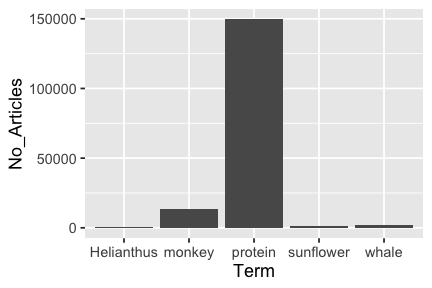
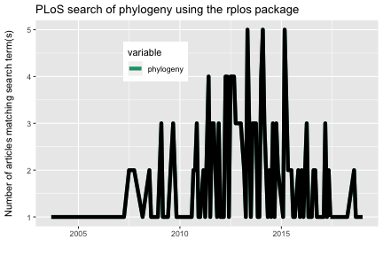

<!--
%\VignetteEngine{knitr::knitr}
%\VignetteIndexEntry{rplos introduction}
%\VignetteEncoding{UTF-8}
-->

rplos introduction
=====


The `rplos` package interacts with the API services of [PLoS](http://www.plos.org/) 
(Public Library of Science) Journals. You used to need an API key to work with 
this package - that is no longer needed!

This tutorial will go through three use cases to demonstrate the kinds
of things possible in `rplos`.

* Search across PLoS papers in various sections of papers
* Search for terms and visualize results as a histogram OR as a plot through 
time
* Text mining of scientific literature

### Load package from CRAN


```r
install.packages("rplos")
```


```r
library('rplos')
```

### Search across PLoS papers in various sections of papers

`searchplos` is a general search, and in this case searches for the term
**Helianthus** and returns the DOI's of matching papers


```r
searchplos(q = "Helianthus", fl = "id", limit = 5)
```

```
#> $meta
#> # A tibble: 1 x 2
#>   numFound start
#>      <int> <int>
#> 1      548     0
#> 
#> $data
#> # A tibble: 5 x 1
#>   id                          
#>   <chr>                       
#> 1 10.1371/journal.pone.0198869
#> 2 10.1371/journal.pone.0148280
#> 3 10.1371/journal.pone.0111982
#> 4 10.1371/journal.pone.0139188
#> 5 10.1371/journal.pone.0057533
```

Get only full article DOIs


```r
searchplos(q = "*:*", fl = 'id', fq = 'doc_type:full', start = 0, limit = 5)
```

```
#> $meta
#> # A tibble: 1 x 2
#>   numFound start
#>      <int> <int>
#> 1   239902     0
#> 
#> $data
#> # A tibble: 5 x 1
#>   id                          
#>   <chr>                       
#> 1 10.1371/journal.pone.0044136
#> 2 10.1371/journal.pone.0155491
#> 3 10.1371/journal.pone.0168631
#> 4 10.1371/journal.pone.0058100
#> 5 10.1371/journal.pone.0168627
```

Get DOIs for only PLoS One articles


```r
searchplos(q = "*:*", fl = 'id', fq = 'journal_key:PLoSONE', 
           start = 0, limit = 5)
```

```
#> $meta
#> # A tibble: 1 x 2
#>   numFound start
#>      <int> <int>
#> 1  1757706     0
#> 
#> $data
#> # A tibble: 5 x 1
#>   id                                                 
#>   <chr>                                              
#> 1 10.1371/journal.pone.0058099/materials_and_methods 
#> 2 10.1371/journal.pone.0030394/introduction          
#> 3 10.1371/journal.pone.0030394/results_and_discussion
#> 4 10.1371/journal.pone.0002157/materials_and_methods 
#> 5 10.1371/journal.pone.0030394/supporting_information
```

Get DOIs for full article in PLoS One


```r
searchplos(q = "*:*", fl = 'id',
   fq = list('journal_key:PLoSONE', 'doc_type:full'),
   start = 0, limit = 5)
```

```
#> $meta
#> # A tibble: 1 x 2
#>   numFound start
#>      <int> <int>
#> 1   204158     0
#> 
#> $data
#> # A tibble: 5 x 1
#>   id                          
#>   <chr>                       
#> 1 10.1371/journal.pone.0044136
#> 2 10.1371/journal.pone.0155491
#> 3 10.1371/journal.pone.0168631
#> 4 10.1371/journal.pone.0058100
#> 5 10.1371/journal.pone.0168627
```

Search for many terms


```r
q <- c('ecology','evolution','science')
lapply(q, function(x) searchplos(x, limit = 2))
```

```
#> [[1]]
#> [[1]]$meta
#> # A tibble: 1 x 2
#>   numFound start
#>      <int> <int>
#> 1    44198     0
#> 
#> [[1]]$data
#> # A tibble: 2 x 1
#>   id                          
#>   <chr>                       
#> 1 10.1371/journal.pone.0001248
#> 2 10.1371/journal.pone.0059813
#> 
#> 
#> [[2]]
#> [[2]]$meta
#> # A tibble: 1 x 2
#>   numFound start
#>      <int> <int>
#> 1    68344     0
#> 
#> [[2]]$data
#> # A tibble: 2 x 1
#>   id                          
#>   <chr>                       
#> 1 10.1371/journal.pbio.2002255
#> 2 10.1371/journal.pbio.0030245
#> 
#> 
#> [[3]]
#> [[3]]$meta
#> # A tibble: 1 x 2
#>   numFound start
#>      <int> <int>
#> 1   210074     0
#> 
#> [[3]]$data
#> # A tibble: 2 x 1
#>   id                          
#>   <chr>                       
#> 1 10.1371/journal.pone.0202320
#> 2 10.1371/journal.pone.0178778
```

### Search on specific sections

A suite of functions were created as light wrappers around `searchplos` as 
a shorthand to search specific sections of a paper.

* `plosauthor` searchers in authors
* `plosabstract` searches in abstracts
* `plostitle` searches in titles
* `plosfigtabcaps` searches in figure and table captions
* `plossubject` searches in subject areas

`plosauthor` searches across authors, and in this case returns the authors of 
the matching papers. the fl parameter determines what is returned


```r
plosauthor(q = "Eisen", fl = "author", limit = 5)
```

```
#> $meta
#> # A tibble: 1 x 2
#>   numFound start
#>      <int> <int>
#> 1      993     0
#> 
#> $data
#> # A tibble: 5 x 1
#>   author                                                                   
#>   <chr>                                                                    
#> 1 Myungsun Kang,Timothy J Eisen,Ellen A Eisen,Arup K Chakraborty,Herman N …
#> 2 Myungsun Kang,Timothy J Eisen,Ellen A Eisen,Arup K Chakraborty,Herman N …
#> 3 Myungsun Kang,Timothy J Eisen,Ellen A Eisen,Arup K Chakraborty,Herman N …
#> 4 Myungsun Kang,Timothy J Eisen,Ellen A Eisen,Arup K Chakraborty,Herman N …
#> 5 Myungsun Kang,Timothy J Eisen,Ellen A Eisen,Arup K Chakraborty,Herman N …
```

`plosabstract` searches across abstracts, and in this case returns the id and 
title of the matching papers


```r
plosabstract(q = 'drosophila', fl = 'id,title', limit = 5)
```

```
#> $meta
#> # A tibble: 1 x 2
#>   numFound start
#>      <int> <int>
#> 1     3451     0
#> 
#> $data
#> # A tibble: 5 x 2
#>   id                    title                                             
#>   <chr>                 <chr>                                             
#> 1 10.1371/journal.pone… Host Range and Specificity of the Drosophila C Vi…
#> 2 10.1371/journal.pone… A Drosophila model for developmental nicotine exp…
#> 3 10.1371/journal.pone… Drosophila Growth Cones Advance by Forward Transl…
#> 4 10.1371/journal.pone… "Larval Defense against Attack from Parasitoid Wa…
#> 5 10.1371/journal.pone… Exogenous expression of Drp1 plays neuroprotectiv…
```

`plostitle` searches across titles, and in this case returns the title and 
journal of the matching papers


```r
plostitle(q = 'drosophila', fl = 'title,journal', limit = 5)
```

```
#> $meta
#> # A tibble: 1 x 2
#>   numFound start
#>      <int> <int>
#> 1     2212     0
#> 
#> $data
#> # A tibble: 5 x 2
#>   journal  title                                                          
#>   <chr>    <chr>                                                          
#> 1 PLOS ONE Peptidergic control in a fruit crop pest: The spotted-wing dro…
#> 2 PLOS ONE Nematocytes: Discovery and characterization of a novel anculea…
#> 3 PLoS ONE In Vivo RNAi Rescue in Drosophila melanogaster with Genomic Tr…
#> 4 PLOS ONE Tandem Duplications and the Limits of Natural Selection in Dro…
#> 5 PLoS ONE A Tripartite Synapse Model in Drosophila
```

### Search terms & visualize results as a histogram OR as a plot through time

`plosword` allows you to search for 1 to K words and visualize the results
as a histogram, comparing number of matching papers for each word


```r
out <- plosword(list("monkey", "Helianthus", "sunflower", "protein", "whale"),
    vis = "TRUE")
out$table
```

```
#>   No_Articles       Term
#> 1       12570     monkey
#> 2         548 Helianthus
#> 3        1529  sunflower
#> 4      142842    protein
#> 5        1758      whale
```


```r
out$plot
```



You can also pass in curl options, in this case get verbose information on the 
curl call.


```r
plosword('Helianthus', callopts = list(verbose = TRUE))
```

```
#> Number of articles with search term 
#>                                 548
```

### Visualize terms

`plot_throughtime` allows you to search for up to 2 words and visualize the 
results as a line plot through time, comparing number of articles matching 
through time. Visualize with the ggplot2 package, only up to two terms for now.


```r
library("ggplot2")
plot_throughtime(terms = "phylogeny", limit = 200) + 
  geom_line(size = 2, color = 'black')
```



### More

See the _Faceted and highlighted searches_ and _Full text_ vignettes for 
more `rplos` help.
